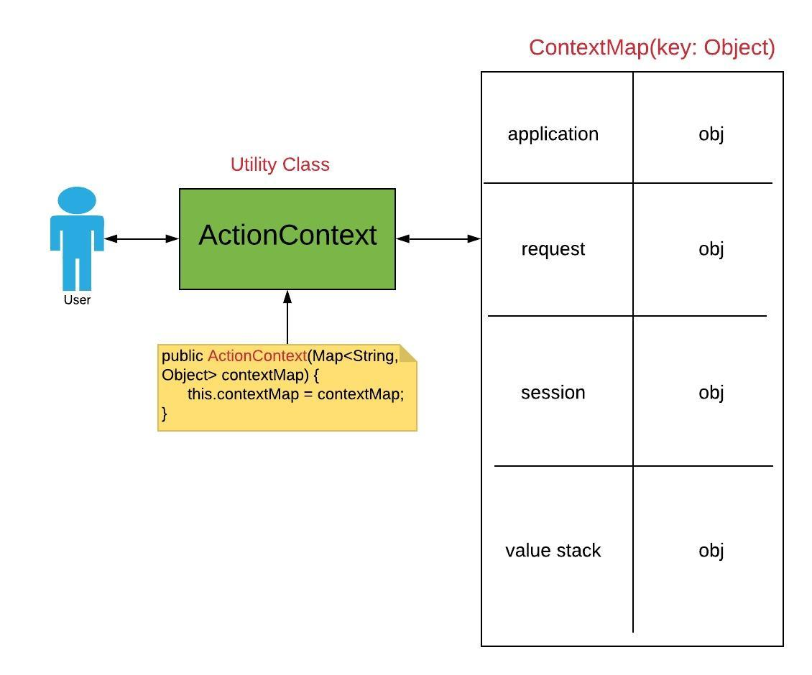

# 中文Struts2笔记 - Part 2

## 1. OGNL 表达式

全称 Object-Graph Navigation Language。 存取Java对象中的任意属性，调用Java对象的方法，能够自动实现必要的类型转换。如果把表达式看作是一个带有语义的字符串，那么OGNL无疑成为这个语义字符串与Java对象之间沟通的桥梁。

 使用OGNL表达式获取数据，是开发中常用。

- 关于OGNL标签的`<s:property value="" />`其中Value属性的取值是一个OGNL的表达式

  ```jsp
  <%-- 
  	Expression to String: %{''} | %{""} 
  	String to Expression: ${} 
  -%>
  <s:property value="%{'OGNLExpression'}" />
  <s:property value="'OGNLExpress'" />
  <hr>
  OGNL: String to OGNL Expression<br>
  <s:textfield name="username" value="%{testAAA}" />
  Here, testAAA is converted to OGNL expression.
  ```

  EL表达式，有三个特点：

  - 不会出现数组越界
  - 不会实现字符串的拼接 `${'a' + 'b'}` incorrect. 
  - 不会出现空指针异常

- 使用OGNL标签，调用方法常用方法

  ```jsp
  <s:property value="'OGNLExpression'.length()" />
  <s:property value="'OGNLExpression'.toUpperCase()" />
  ```

- 使用OGNL标签，访问类的静态成员: `@package.package…Class@Staticmethod`

  ```jsp
  Max value: <s:property value="@java.lang.Integer@MAX_VALUE" />
  ```

- 使用OGNL标签，访问类的静态方式，需要开启OGNL的静态方法访问权限，在struts.xml文件中，添加下面的设置：

  ```xml
  <constant name="struts.ognl.allowStaticMethodAccess" value="true" />
  ```

  然后再下面调用：

  ```jsp
  <s:property value="@java.lang.Math@random()" /> 
  ```

- OGNL操作集合List和Map

   ```jsp
  <s:radio list="{'Female', 'Male'}" name="gender" label="Gender" />
  ```

  创建Map集合：存储key:value对

  ```jsp
  <s:radio list="#{'Female':'女', 'Male':'男'}" name="gender" label="Gender" />
  ```

## 2. OGNL上下文`ContextMap`

是Struts2框架中，封装数据最大的容器，封装了我们一次请求可能会用到的所有数据。

是一个Map结构，Map的key是Strong类型，Map的value是Object类型

<b>常用的数据内容：</b>

- <u>*application: Map, 存储的是应用域的所有数据*</u>
- <u>*session：Map，会话域中的所有数据*</u>
- **value stack (root)：对象，List结构**, （这个是重点）
- action(the current action)：对象，表示当前正执行的action对象
- *<u>request：Map，请求域中的所有数据</u>*
- parameters：Map，存储请求参数。request.getParameterMap();
- attr(search page, request, session, then application scopes): Map, 里面存储的是四大域中的数据，并且查找是按照由小到大的顺序找。

## 3. ActionContext Vs. ContextMap



```java
#ActionContext Source code
public class ActionContext implements Serializable {

    static ThreadLocal<ActionContext> actionContext = new ThreadLocal<>();

    /**
     * Constant for the name of the action being executed.
     */
    public static final String ACTION_NAME = "com.opensymphony.xwork2.ActionContext.name";

    /**
     * Constant for the {@link com.opensymphony.xwork2.util.ValueStack OGNL value stack}.
     */
    public static final String VALUE_STACK = ValueStack.VALUE_STACK;

    /**
     * Constant for the action's session.
     */
    public static final String SESSION = "com.opensymphony.xwork2.ActionContext.session";

    /**
     * Constant for the action's application context.
     */
    public static final String APPLICATION = "com.opensymphony.xwork2.ActionContext.application";

    /**
     * Constant for the action's parameters.
     */
    public static final String PARAMETERS = "com.opensymphony.xwork2.ActionContext.parameters";

    /**
     * Constant for the action's locale.
     */
    public static final String LOCALE = "com.opensymphony.xwork2.ActionContext.locale";

    /**
     * Constant for the action's type converter.
     */
    public static final String TYPE_CONVERTER = "com.opensymphony.xwork2.ActionContext.typeConverter";

    /**
     * Constant for the action's {@link com.opensymphony.xwork2.ActionInvocation invocation} context.
     */
    public static final String ACTION_INVOCATION = "com.opensymphony.xwork2.ActionContext.actionInvocation";

    /**
     * Constant for the map of type conversion errors.
     */
    public static final String CONVERSION_ERRORS = "com.opensymphony.xwork2.ActionContext.conversionErrors";


    /**
     * Constant for the container
     */
    public static final String CONTAINER = "com.opensymphony.xwork2.ActionContext.container";
    
    private Map<String, Object> context;

    /**
     * Creates a new ActionContext initialized with another context.
     *
     * @param context a context map.
     */
    public ActionContext(Map<String, Object> context) {
        this.context = context;
    }


    /**
     * Sets the action invocation (the execution state).
     *
     * @param actionInvocation the action execution state.
     */
    public void setActionInvocation(ActionInvocation actionInvocation) {
        put(ACTION_INVOCATION, actionInvocation);
    }

    /**
     * Gets the action invocation (the execution state).
     *
     * @return the action invocation (the execution state).
     */
    public ActionInvocation getActionInvocation() {
        return (ActionInvocation) get(ACTION_INVOCATION);
    }

    /**
     * Sets the action's application context.
     *
     * @param application the action's application context.
     */
    public void setApplication(Map<String, Object> application) {
        put(APPLICATION, application);
    }

    /**
     * Returns a Map of the ServletContext when in a servlet environment or a generic application level Map otherwise.
     *
     * @return a Map of ServletContext or generic application level Map
     */
    public Map<String, Object> getApplication() {
        return (Map<String, Object>) get(APPLICATION);
    }

    /**
     * Sets the action context for the current thread.
     *
     * @param context the action context.
     */
    public static void setContext(ActionContext context) {
        actionContext.set(context);
    }

    /**
     * Returns the ActionContext specific to the current thread.
     *
     * @return the ActionContext for the current thread, is never <tt>null</tt>.
     */
    public static ActionContext getContext() {
        return actionContext.get();
    }

    /**
     * Sets the action's context map.
     *
     * @param contextMap the context map.
     */
    public void setContextMap(Map<String, Object> contextMap) {
        getContext().context = contextMap;
    }

    /**
     * Gets the context map.
     *
     * @return the context map.
     */
    public Map<String, Object> getContextMap() {
        return context;
    }

    /**
     * Sets conversion errors which occurred when executing the action.
     *
     * @param conversionErrors a Map of errors which occurred when executing the action.
     */
    public void setConversionErrors(Map<String, Object> conversionErrors) {
        put(CONVERSION_ERRORS, conversionErrors);
    }

    /**
     * Gets the map of conversion errors which occurred when executing the action.
     *
     * @return the map of conversion errors which occurred when executing the action or an empty map if
     *         there were no errors.
     */
    public Map<String, Object> getConversionErrors() {
        Map<String, Object> errors = (Map) get(CONVERSION_ERRORS);

        if (errors == null) {
            errors = new HashMap<>();
            setConversionErrors(errors);
        }

        return errors;
    }

    /**
     * Sets the Locale for the current action.
     *
     * @param locale the Locale for the current action.
     */
    public void setLocale(Locale locale) {
        put(LOCALE, locale);
    }

    /**
     * Gets the Locale of the current action. If no locale was ever specified the platform's
     * {@link java.util.Locale#getDefault() default locale} is used.
     *
     * @return the Locale of the current action.
     */
    public Locale getLocale() {
        Locale locale = (Locale) get(LOCALE);

        if (locale == null) {
            locale = Locale.getDefault();
            setLocale(locale);
        }

        return locale;
    }

    /**
     * Sets the name of the current Action in the ActionContext.
     *
     * @param name the name of the current action.
     */
    public void setName(String name) {
        put(ACTION_NAME, name);
    }

    /**
     * Gets the name of the current Action.
     *
     * @return the name of the current action.
     */
    public String getName() {
        return (String) get(ACTION_NAME);
    }

    /**
     * Sets the action parameters.
     *
     * @param parameters the parameters for the current action.
     */
    public void setParameters(HttpParameters parameters) {
        put(PARAMETERS, parameters);
    }

    /**
     * Returns a Map of the HttpServletRequest parameters when in a servlet environment or a generic Map of
     * parameters otherwise.
     *
     * @return a Map of HttpServletRequest parameters or a multipart map when in a servlet environment, or a
     *         generic Map of parameters otherwise.
     */
    public HttpParameters getParameters() {
        return (HttpParameters) get(PARAMETERS);
    }

    /**
     * Sets a map of action session values.
     *
     * @param session  the session values.
     */
    public void setSession(Map<String, Object> session) {
        put(SESSION, session);
    }

    /**
     * Gets the Map of HttpSession values when in a servlet environment or a generic session map otherwise.
     *
     * @return the Map of HttpSession values when in a servlet environment or a generic session map otherwise.
     */
    public Map<String, Object> getSession() {
        return (Map<String, Object>) get(SESSION);
    }

    /**
     * Sets the OGNL value stack.
     *
     * @param stack the OGNL value stack.
     */
    public void setValueStack(ValueStack stack) {
        put(VALUE_STACK, stack);
    }

    /**
     * Gets the OGNL value stack.
     *
     * @return the OGNL value stack.
     */
    public ValueStack getValueStack() {
        return (ValueStack) get(VALUE_STACK);
    }
    
    /**
     * Gets the container for this request
     * 
     * @param cont The container
     */
    public void setContainer(Container cont) {
        put(CONTAINER, cont);
    }
    
    /**
     * Sets the container for this request
     * 
     * @return The container
     */
    public Container getContainer() {
        return (Container) get(CONTAINER);
    }
    
    public <T> T getInstance(Class<T> type) {
        Container cont = getContainer();
        if (cont != null) {
            return cont.getInstance(type);
        } else {
            throw new XWorkException("Cannot find an initialized container for this request.");
        }
    }

    /**
     * Returns a value that is stored in the current ActionContext by doing a lookup using the value's key.
     *
     * @param key the key used to find the value.
     * @return the value that was found using the key or <tt>null</tt> if the key was not found.
     */
    public Object get(String key) {
        return context.get(key);
    }

    /**
     * Stores a value in the current ActionContext. The value can be looked up using the key.
     *
     * @param key   the key of the value.
     * @param value the value to be stored.
     */
    public void put(String key, Object value) {
        context.put(key, value);
    }
}
```

- ActionContext，每次请求都会创建新的对象，放在request对象中。

  Struts中，有一个能够在页面中可以调试的标签，能够直接显示在各个域中存储的数据。`<s:debug />`

  Here is how you can get the data from request 

  ```java
  public String demo1() {
  		ActionContext context = ActionContext.getContext();
  		context.put("contextMap", "Hello, Context Map");
  		
  		// Application 
  		ServletContext applicationContext = ServletActionContext.getServletContext();
  		applicationContext.setAttribute("applicationAttr", "Hello, application attr");
  		
  		Map<String, Object> applicationMap = context.getApplication();
  		applicationMap.put("applicationMap", "hello, application map");
  		return SUCCESS;
  }
  ```

- 使用OGNL标签获取域中的数据：`#key`

  ```jsp
  <s:property value="#contextMap" /><br/>
  <s:property value="#application.applicationAttr" /><br/>
  ```

## 4. Value Stack 值栈

1. 使用List实现的stack数据结构。

2. 实现往Stack中放入数据：

   ```java
   public String demo2() {
   		ActionContext context = ActionContext.getContext();
   		
   		// Get Value Stack
   		ValueStack valueStack = context.getValueStack();
   		
   		Student student = new Student("Frank, Wang", 29, "Male");
   		// Push to stack
   		valueStack.push(student);
   	
   		return SUCCESS;
   }
   ```

   获取Student对象中的数据：

   ```jsp
   <s:property value="name" /> | <s:property value="age" /> | <s:property value="gender" />
   ```

   总结：

   - <b>如何放入一个数据进入值栈呢？</b>

   定一个类的成员，并且生成这个成员的get方法。

   -  <b>如果有两个相同名称的值，如何获取对应的值呢？</b>

   使用数组的下标进行访问 `<s:property value="[0].name" /> | <s:property vlaue="[1].name" />`

   - 如果标签中只有一个`<s:property />` 获取的数据是栈顶对象的数据。

   ## 5. EL表达式

   搜素范围：

   Page -> Request -> Session -> Applicaiton

   OGNL 表达式：

   `<s:property value="name" />`

   这里的EL取值会发生改变：因为Struts2会在值栈中查找。

   这里的Struts2 对EL表达式的改变：

   Page -> request -> valueStack -> applicationMap -> session -> Application

   在页面中，仍然使用EL表达式进行获取。

   ## 6. OGNL符号总结

   %: 把OGNL表达式转成普通字符串 %{" "}; 把字符串转成OGNL表达式%{ };

   \#: 获取ContextMap中的数据。#key; 在页面中可以创建Map集合 #{ }

   $: EL 表达式使用； 可以在struts2 的配置中使用OGNL表达式，配置可以是xml文件，也可以是注解。 

   ## 7. 使用OGNL表达式在CRM项目中应用

   在Action类中，定义一个`List<Customer>` 的成员，然后生成get和set方法。

   使用struts2中的迭代标签：<s:iterator />

   ```jsp
   <s:iterator value="customers">
     <tr>
     <td>${custName }</td>
     <td>${custIndustry }</td>
     <td>${custLevel }</td>
     <td>${custAddress }</td>
     <td>${custPhone }</td>
     <td>${custSource }</td>
     <td><a href="#" class="btn btn-link btn-sm">Edit</a> 
     <a href="javascript:delOne(${custId})" class="btn btn-danger btn-sm">Delete</a>
     </td>
     </tr>
   </s:iterator>
   ```

   

​	