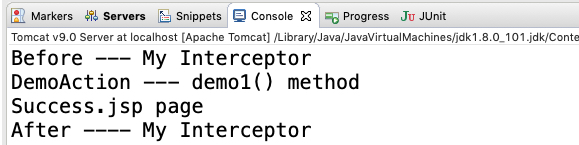

# 中文Struts2笔记 - Part 3

>1. 拦截器
>2. struts2注解配置

## 1. Struts2中的拦截器

拦截器是动态拦截Action调用的对象，提供了一种机制，可以使开发者在定义的action执行的前后加入执行的代码，也可以在一个action执行前阻止其执行。


拦截器链（Interceptor Chain), 也称为Stack。

- 过滤器是Sevlet规范中的一部分，任何Java Web工程都可以使用
- 拦截器是struts2框架的一部分，只有使用了Struts2才可以使用。
- 过滤器的功能更强大。

拦截器是AOP编程思想的具体实现。AOP简单来说就是在不修改源码的基础上，对已有的方法进行动态增强。在struts2中拦截器就是对我们动作方法进行增强。（其实就是把重复性的代码提取出来放到拦截器中，统一管理，统一调用）。

### 1.1 如何实现一个拦截器？

1. 创建一个类，继承`AbstractInterceptor`

   ```java
   public class MyInterceptor extends AbstractInterceptor{
   	@Override
   	public String intercept(ActionInvocation invocation) throws Exception {
   		System.out.println("Before --- My Interceptor");
   		String invokeVal = invocation.invoke();
   		System.out.println("After ---- My Interceptor");
   		return invokeVal;
   	}
   }
   
   ```

2. 在struts.xml文件中，对过滤器进行配置。

   ```xml
   <!-- 声明这个拦截器 -->
   <package>
   	<interceptors>
   		<interceptor name="myInterceptor" class="com.frank.web.interceptor.MyInterceptor" />
   	</interceptors>
   	
   	<!-- 使用这个拦截器 -->
   	<action name="demo1" class="com.frank.web.action.DemoAction" method="demo1">
   		<interceptor-ref name="myInterceptor" />
   		<result>/success.jsp</result>
   	</action>
   </package>
   ```

3. 在jsp中，实现一些展示的内容。

   ```jsp
   <%
   	System.out.println("Success.jsp page");
   %>
   ```

4. 实现`DemoAction` 类，继承`ActionSupport` 这个类。

   ```java
   public class DemoAction extends ActionSupport {
   	public String demo1() {
   		System.out.println("DemoAction --- demo1() method");
   		return SUCCESS;
   	}
   }	
   ```

   

### 1.2 拦截器中，invoke的返回值

invoke的返回值就是动作方法的返回值，比如说是success,error...

`invocation.invoke()` 这个方法执行以后，就已经通过了拦截器的控制。

### 1.3 拦截器的执行顺序

按照一个栈的结构，先进后出，根据这样的条件进行执行。

拦截器的执行顺序，是有引用顺序决定的。

### 1.4 登录检查练习


## 2. 注解配置